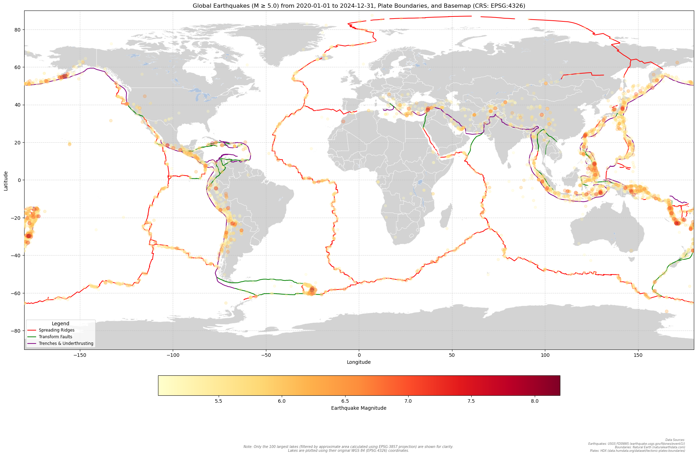

# Deliverables

This document outlines the key outputs and visualizations generated during the project.
See the [earthquake_plate_notebook_minmag=1.0.ipynb](earthquake_plate_notebook_minmag=1.0.ipynb) for the notebook that generated these images and statistics. Supporting custom functions are in the [functions](functions/) folder.

## ***Question to answer:***
"Is there a quantifiable correlation between earthquake magnitude and the distance from the nearest fault line, and does this relationship vary by fault type? Specifically, can earthquake magnitude be used to predict proximity to a fault line, or vice versa?"

---

## Earthquake Maps

**World Map of Earthquakes (Min Magnitude 5.0) and Plate Boundaries**

**World Map of Earthquakes (Min Magnitude 1.0) and Plate Boundaries**

---

## Ridge Type Analysis (Min Magnitude 1.0)
**Histogram**

**Box and Whisker Plot**

### Interpretation
***Trench histogram:*** Interesting...not sure what the bit in trench around 6-8k km is...

***All box plots are skewed toward a lower median and lower quartile.***

***Ridge Box Plot:*** Lowest median. Lots of outliers above the upper whisker.

***Transform Box Plot:*** Has a lot of outliers above and below box plot, and most values are compressed into a very narrow distance range. Mid-range median among the three.

***Trench Box Plot:*** No outliers, has such a large range with the box plot extending 6-8k km in the upper quartile (compared to the histogram), and median is highest among the three ridge types.

---

## Analysis:

### Ridge Likelihood Differences @ 1000km max distance

Analyzes if there is a statistically significant difference in the likelihood of earthquakes occurring within a certain distance of a specific ridge type compared to other ridge types.

#### Results for Ridge
- **Compared to Transform:**
  - **Statistic:** 4,410,723,485.0  
  - **P-value:** 1.0  
  - **Interpretation:** There is no significant difference in the likelihood of earthquakes occurring within 100km of ridge compared to transform.

- **Compared to Trench:**
  - **Statistic:** 4,926,931,743.0  
  - **P-value:** 1.0  
  - **Interpretation:** There is no significant difference in the likelihood of earthquakes occurring within 100km of ridge compared to trench.

#### Results for Transform
- **Compared to Ridge:**
  - **Statistic:** 5,076,412,131.0  
  - **P-value:** 0.0  
  - **Interpretation:** Earthquakes are significantly more likely to occur within 100km of transform compared to ridge.

- **Compared to Trench:**
  - **Statistic:** 1,111,928,881.0  
  - **P-value:** 1.0  
  - **Interpretation:** There is no significant difference in the likelihood of earthquakes occurring within 100km of transform compared to trench.

#### Results for Trench
- **Compared to Ridge:**
  - **Statistic:** 6,009,807,713.0  
  - **P-value:** 0.0  
  - **Interpretation:** Earthquakes are significantly more likely to occur within 100km of trench compared to ridge.

- **Compared to Transform:**
  - **Statistic:** 1,177,981,770.0  
  - **P-value:** 8.36 × 10⁻⁴⁹  
  - **Interpretation:** Earthquakes are significantly more likely to occur within 100km of trench compared to transform.

#### Based on the provided results, we can make the following statements about the likelihood of earthquakes occurring within 100km of different ridge types:

*   **Trenches vs. Other Ridge Types:** Earthquakes are significantly more likely to occur within 100km of trenches compared to both ridges and transform faults. This suggests that trenches are a more seismically active environment in close proximity (within 100km) than the other two.
*   **Transform Faults vs. Ridges:** Earthquakes are significantly more likely to occur within 100km of transform faults compared to ridges. This suggests that transform faults also represent a more seismically active setting within 100km than ridges.
*   **Ridges vs. All Others:** There is *no* statistically significant difference in earthquake likelihood between ridges and either trenches or transform faults. This suggests that ridges, at least within 100km, are the *least* likely of these three plate boundary types to have nearby earthquakes.
*   **Transform Faults vs Trenches:** Earthquakes are not significantly different between transform faults and trenches.

**In summary,** these findings suggest a hierarchy in terms of the likelihood of earthquakes occurring within 100km of these plate boundary types:

**Trenches > Transform Faults > Ridges.**

Specifically, we can say:

1.  Earthquakes are generally more concentrated near trenches within a 100km radius compared to the others.
2.  Earthquakes are more common near transform faults compared to ridges within 100km, but the difference is not always significant compared to trenches.
3.  Ridge plate boundaries are less likely than trench plate boundaries to have earthquakes within 100km. The liklihood of them having earthquakes is similar to transform faults.

### Ridge Likelihood Differences @ 1000km max distance

Analyzes if there is a statistically significant difference in the likelihood of earthquakes occurring within a certain distance of a specific ridge type compared to other ridge types.

#### Results for Ridge
- **Compared to Transform:**
  - **Statistic:** 3,232,547,859.5  
  - **P-value:** 1.0  
  - **Interpretation:** There is no significant difference in the likelihood of earthquakes occurring within 1000km of ridge compared to transform.

- **Compared to Trench:**
  - **Statistic:** 7,412,428,870.5  
  - **P-value:** 0.0  
  - **Interpretation:** Earthquakes are significantly more likely to occur within 1000km of ridge compared to trench.

#### Results for Transform
- **Compared to Ridge:**
  - **Statistic:** 6,254,587,756.5  
  - **P-value:** 0.0  
  - **Interpretation:** Earthquakes are significantly more likely to occur within 1000km of transform compared to ridge.

- **Compared to Trench:**
  - **Statistic:** 1,916,713,189.0  
  - **P-value:** 0.0  
  - **Interpretation:** Earthquakes are significantly more likely to occur within 1000km of transform compared to trench.

#### Results for Trench
- **Compared to Ridge:**
  - **Statistic:** 3,524,310,585.5  
  - **P-value:** 1.0  
  - **Interpretation:** There is no significant difference in the likelihood of earthquakes occurring within 1000km of trench compared to ridge.

- **Compared to Transform:**
  - **Statistic:** 373,197,462.0  
  - **P-value:** 1.0  
  - **Interpretation:** There is no significant difference in the likelihood of earthquakes occurring within 1000km of trench compared to transform.

Based on the provided results for a 1000km radius, we can make the following statements about the likelihood of earthquakes occurring within 1000km of different ridge types:

*   **Trenches vs. Ridges:** Earthquakes are significantly more likely to occur within 1000km of trenches compared to ridges. This remains consistent with the 100km analysis and reinforces the idea that trenches are associated with higher seismic activity over a broader area.
*   **Transform Faults vs. Ridges:** Earthquakes are significantly more likely to occur within 1000km of transform faults compared to ridges. This also remains consistent with the 100km analysis, suggesting that transform faults have more widespread seismic activity compared to ridges.
*   **Trenches vs. Transform Faults:** There is *no* statistically significant difference in earthquake likelihood between trenches and transform faults within 1000km.  This is a key difference from the 100km analysis.
*   **Ridges vs. All Others:** There is *no* statistically significant difference in earthquake likelihood between ridges and either trenches or transform faults.

**In summary,** these findings suggest a different hierarchy in terms of the likelihood of earthquakes occurring within 1000km of these plate boundary types:

**Trenches ≈ Transform Faults > Ridges.**

Specifically, we can say:

1.  Earthquakes are generally more concentrated near both trenches and transform faults within a 1000km radius compared to ridges.
2.  Trench plate boundaries are more likely than ridge plate boundaries to have earthquakes within 1000km.
3.  Transform fault plate boundaries are more likely than ridge plate boundaries to have earthquakes within 1000km.

### **The key differences between the 100km and 1000km analyses are:**

*   **Trenches and Transform Faults:** At 100km, trenches were significantly more likely to have nearby earthquakes than transform faults. At 1000km, this difference disappears, and the likelihood of earthquakes is similar for both. This suggests that the influence of trenches on earthquake occurrence extends further out but isn't necessarily more intense very close to the boundary compared to transform faults.
*   **Overall Hierarchy:** At 100km, the hierarchy was Trenches > Transform Faults > Ridges. At 1000km, the hierarchy shifts to Trenches ≈ Transform Faults > Ridges. The distinction between trenches and transform faults becomes less clear at the larger distance.
* **Interpretation:** At 1000km, the influence of a ridge plate boundary on how likely earthquakes are to occur significantly diminishes relative to other plates.

---

### **Correlation Between Magnitude and Distance Separately for Each Plate Boundary Type**
Calculates the Spearman rank correlation between magnitude and distance separately for each plate boundary type.

*   **--- ridge ---**
    *   **Spearman's rho: 0.175:** This is a positive correlation coefficient. It indicates that as one variable (magnitude) increases, the other variable (distance to the ridge) tends to increase as well.
    *   **P-value: 0:** This p-value is extremely small (likely much smaller than 0.05, displayed as 0 due to precision limits). This means the observed correlation is highly statistically significant – it's very unlikely you'd see a correlation this strong just by random chance if there were no real relationship.
    *   **Interpretation:** "There is a statistically significant weak-to-moderate positive correlation: higher magnitude earthquakes tend to occur slightly further from the ridge boundary."
        *   **In simpler terms:** For spreading ridges (where plates move apart), the analysis suggests that *larger earthquakes are slightly more likely to happen further away* from the main ridge line compared to smaller earthquakes. The correlation strength (0.175) is considered weak to moderate, meaning distance isn't a *very* strong predictor of magnitude near ridges, but there is a detectable trend.

*   **--- transform ---**
    *   **Spearman's rho: -0.220:** This is a negative correlation coefficient. It indicates that as one variable (magnitude) increases, the other variable (distance to the transform fault) tends to decrease.
    *   **P-value: 0:** Again, a very small p-value indicating high statistical significance.
    *   **Interpretation:** "There is a statistically significant weak-to-moderate negative correlation: higher magnitude earthquakes tend to occur slightly closer to the transform boundary."
        *   **In simpler terms:** For transform faults (where plates slide past each other, like the San Andreas Fault), this analysis suggests that *larger earthquakes are slightly more likely to happen closer* to the main fault line compared to smaller earthquakes. The strength (-0.220) is still weak to moderate.

*   **--- trench ---**
    *   **Spearman's rho: -0.443:** This is a negative correlation coefficient, and its absolute value is noticeably larger than the others. This indicates a stronger tendency for one variable (magnitude) to increase as the other (distance to the trench) decreases.
    *   **P-value: 0:** Highly statistically significant.
    *   **Interpretation:** "There is a statistically significant weak-to-moderate negative correlation: higher magnitude earthquakes tend to occur slightly closer to the trench boundary." (Note: While the code labels -0.443 as "weak-to-moderate", many statisticians would classify a correlation of this magnitude as moderate).
        *   **In simpler terms:** For subduction zones/trenches (where one plate slides beneath another), this analysis shows a moderate tendency for *larger earthquakes to occur closer* to the trench line (which often represents the surface trace of the subduction zone). This makes geological sense, as the largest earthquakes (megathrust events) typically occur on the interface between the subducting and overriding plates, relatively close to the trench.

### Overall Interpretation and Key Takeaways

*   **Different boundaries have different patterns:** The relationship between earthquake magnitude and distance to the plate boundary is *not* the same for all boundary types. Analyzing them separately can help us spot key differences.
*   **Statistical Significance:** For all three boundary types that I analyzed, the relationship that was found (whether it was positive or negative) is statistically significant! In other words, the observed patterns are unlikely to be random flukes in *this specific dataset*.
*   **Strength of Correlation:** The correlations are generally weak to moderate (rho values between -0.443 and 0.175). This means that while there's a detectable relationship, the distance from the boundary is only *one* factor influencing earthquake magnitude, and it doesn't explain *all* the variation. Other factors (like depth, stress accumulation, fault geometry, etc.) are also crucial.
*   **Geological Plausibility:**
    *   The negative correlations for transform and trench boundaries (larger quakes closer) align with general geological understanding, where the main fault/plate interface is the primary source of large events.
    *   The weak positive correlation for ridges (larger quakes slightly further) might reflect complexities in how spreading centers accommodate stress or potentially how the "boundary" itself is defined geographically versus the zone of deformation.