# Project Setup Precursors

[Back to Main README](./README.md)

## Setup Flowchart

```mermaid
graph TD
    %%{init: { 'themeVariables': { 'nodeBorder': '#666', 'clusterBorder': '#666', 'lineColor': '#555' }}}%%
    %% Main Sections as Subgraphs

    subgraph Step1 ["1: Install VS Code"]
        direction TB
        A[Download & Install VS Code];
    end

    subgraph Step2 ["2: Install Extensions"]
        direction TB
        B1[Markdown Preview Github Styling];
        B2[Markdown Preview Mermaid Support];
        B3[Roo Code];
    end

    subgraph Step3 ["3: API Key --> Roo Code"]
        direction TB


        subgraph S3_1 [3.1 Login]
            direction TB
            C1[Go to Google AI Studio];
            C2[Use Personal Google Account if needed];
            C1 --> C2;
        end

        subgraph S3_2 [3.2 Generate API Key]
            direction TB
            D1[Accept Terms];
            D2[Create & Copy API Key];
            D1 --> D2;
        end

        subgraph S3_3 [3.3 Configure RooCode in VS Code]
            direction TB
            E1[Select Google Gemini Provider];
            E2[Paste API Key];
            E3[Choose Model: Gemini 2.5 Exp Pro];
            E4["Rename Model (Optional)"];
            E5[Set Permissions: Auto-approve read];
            E1 --> E2 --> E3 --> E4 --> E5;
        end

        subgraph S3_4 [3.4 Enable Billing for API Access]
            direction TB
            F1[Upgrade to Tier 1];
            F2[Add Billing Account & Accept Terms for $300 free credits];
            F3[Associate Billing Account with Project];
            F4[Confirm Tier 1 Status];
            F1 --> F2 --> F3 --> F4;
        end

        %% Connect Sub-steps within Step 3
        S3_1 --> S3_2 --> S3_3 --> S3_4;
    end

    subgraph Step4 ["4: Setup Conda"]
        direction TB
        G1["Install Miniconda (winget)"];
        G2["Add to PATH"];
        G3["Reboot"];
        G4["Test Installation (conda --version)"];
        G5["Install Geospatial Libraries"];
        G1 --> G2 --> G3 --> G4 --> G5;
    end

    subgraph Step5 ["5: Setup Git & Repo"]
        direction TB
        H1["Install Git (winget)"];
        H2["Get GitHub Token"];
        H3["Configure Git User"];
        H4["Initialize Repo & Add Remote"];
        H5["Create README, Commit, Push"];
        H6["Login with Token"];
        H7["Feature Branch Workflow"];
        H1 --> H2 --> H3 --> H4 --> H5 --> H6 --> H7;
    end

    %% Connect Main Steps
    Step1 --> Step2 --> Step3 --> Step4 --> Step5;

    Step5 --> Z([Setup Complete]);

    %% Styling
    %% Subgraph Backgrounds
    style Step1 fill:#E0F2F7,color:#000,stroke:#666 %% Light Blue
    style Step2 fill:#E8F5E9,color:#000,stroke:#666 %% Light Green
    style Step3 fill:#F3E5F5,color:#000,stroke:#666 %% Light Lavender
    style S3_1 fill:#FCE4EC,color:#000,stroke:#666 %% Light Pink
    style S3_2 fill:#FFE0B2,color:#000,stroke:#666 %% Light Orange
    style S3_3 fill:#E0F7FA,color:#000,stroke:#666 %% Light Cyan
    style S3_4 fill:#F5F5F5,color:#000,stroke:#666
    style Step4 fill:#FFF9C4,color:#000,stroke:#666 %% Light Yellow
    style Step5 fill:#B2DFDB,color:#000,stroke:#666 %% Light Teal

    %% Individual Node Styling (Smallest Boxes)
    style A fill:#FAFAFA,stroke:#666,color:#000
    style B1 fill:#FAFAFA,stroke:#666,color:#000
    style B2 fill:#FAFAFA,stroke:#666,color:#000
    style B3 fill:#FAFAFA,stroke:#666,color:#000
    style C1 fill:#FAFAFA,stroke:#666,color:#000
    style C2 fill:#FAFAFA,stroke:#666,color:#000
    style D1 fill:#FAFAFA,stroke:#666,color:#000
    style D2 fill:#FAFAFA,stroke:#666,color:#000
    style E1 fill:#FAFAFA,stroke:#666,color:#000
    style E2 fill:#FAFAFA,stroke:#666,color:#000
    style E3 fill:#FAFAFA,stroke:#666,color:#000
    style E4 fill:#FAFAFA,stroke:#666,color:#000
    style E5 fill:#FAFAFA,stroke:#666,color:#000
    style F1 fill:#FAFAFA,stroke:#666,color:#000
    style F2 fill:#FAFAFA,stroke:#666,color:#000
    style F3 fill:#FAFAFA,stroke:#666,color:#000
    style F4 fill:#FAFAFA,stroke:#666,color:#000
    style F4 fill:#FAFAFA,stroke:#666,color:#000
    style G1 fill:#FAFAFA,stroke:#666,color:#000
    style G2 fill:#FAFAFA,stroke:#666,color:#000
    style G3 fill:#FAFAFA,stroke:#666,color:#000
    style G4 fill:#FAFAFA,stroke:#666,color:#000
    style G5 fill:#FAFAFA,stroke:#666,color:#000
    style H1 fill:#FAFAFA,stroke:#666,color:#000
    style H2 fill:#FAFAFA,stroke:#666,color:#000
    style H3 fill:#FAFAFA,stroke:#666,color:#000
    style H4 fill:#FAFAFA,stroke:#666,color:#000
    style H5 fill:#FAFAFA,stroke:#666,color:#000
    style H6 fill:#FAFAFA,stroke:#666,color:#000
    style H7 fill:#FAFAFA,stroke:#666,color:#000
    style Z fill:#FAFAFA,stroke:#666,color:#000
```



This guide outlines the initial steps required to prepare your development environment before beginning active coding.

---

## 1. Install Visual Studio Code

Download and install [VS Code](https://code.visualstudio.com/), our primary code editor for the project.

---

## 2. Install Essential VS Code Extensions

To enhance Markdown rendering and integrate AI-assisted coding, install the following extensions via the Extensions panel (`Ctrl+Shift+X` or `Cmd+Shift+X` on Mac):

- **Markdown Preview Github Styling**: Adds rich previews for Markdown documents, including diagrams.
- **Markdown Preview Mermaid Support**: Enables support for Mermaid.js diagrams in Markdown.
- **Roo Code**: A coding assistant that connects to LLMs like Google Gemini. RooCode can analyze your codebase, make edits, and assist with development when given the right permissions.

---

## 3. Set Up Google AI Studio and API Access

1. **Login**
   - Go to [Google AI Studio](https://makersuite.google.com/).
   - Use a **personal Google account** if your school account has project restrictions.

2. **Generate API Key**
   - Accept terms and create an API key.
   - Copy the key for use in VS Code.

3. **Configure RooCode in VS Code**
   - Open settings and select **Google Gemini** as the provider.
   - Paste the API key.
   - Choose model: **Gemini 2.5 Experimental Pro (325)**.
   - Rename the model to: `Google-Gemini-2.5-Pro-Exp-03-25` (optional).
   - Set permissions to: **Auto-approve read operations only**.

4. **Enable Billing for API Access**
   - Upgrade to **Tier 1** in Google Cloud.
   - Add a billing account and accept the terms.
   - You'll receive **$300 in free credits** (90-day trial).
   - Associate the billing account with your API project.
   - Confirm you're on **Tier 1** to avoid rate limits.

## 4. **Setup Conda (on Windows) Env**
   - Run in a shell: `winget install -e --id Anaconda.Miniconda3`
   - Add the following to your windows environmental variables
        ```
        %USERPROFILE%\miniconda3\
        %USERPROFILE%\miniconda3\Library\bin
        %USERPROFILE%\miniconda3\Scripts
        ```
   - Reboot
   - Test: open powershell and make sure `conda --version` returns a conda version with no error
   - Install some basic key geospatial libraries in the base conda env `conda install -c conda-forge notebook pandas geopandas requests folium plotly matplotlib shapely cartopy rasterio -y`

## 5. **Setup git, a git repo, and push code base to it**
   - `winget install --id Git.Git -e`
   - Get a token key from github for user and copy to clipboard.
   - Initialize the git repo
        ```
        git config --global user.name "Your Name"
        git config --global user.email "your@email.com"
        ```
  - Sign into git when you 
        ```
        git init
        git remote add origin https://github.com/yourusername/your-repo.git
        ```
  - Create `README.md`, commit, and push to the main branch.
  - When you first push to github, login and choose token when prompted and paste in your token.
  - Loop through until project finished.
    - Create branches for each new feature.
    - Commit each major step and add a comment about what was done.
    - Push to feature branch. 
    - Make Pull Request to merge to main.
    - Review PR.
    - Merge to main

---

You’re now ready to begin development with full Markdown support and LLM integration via RooCode and Google Gemini.